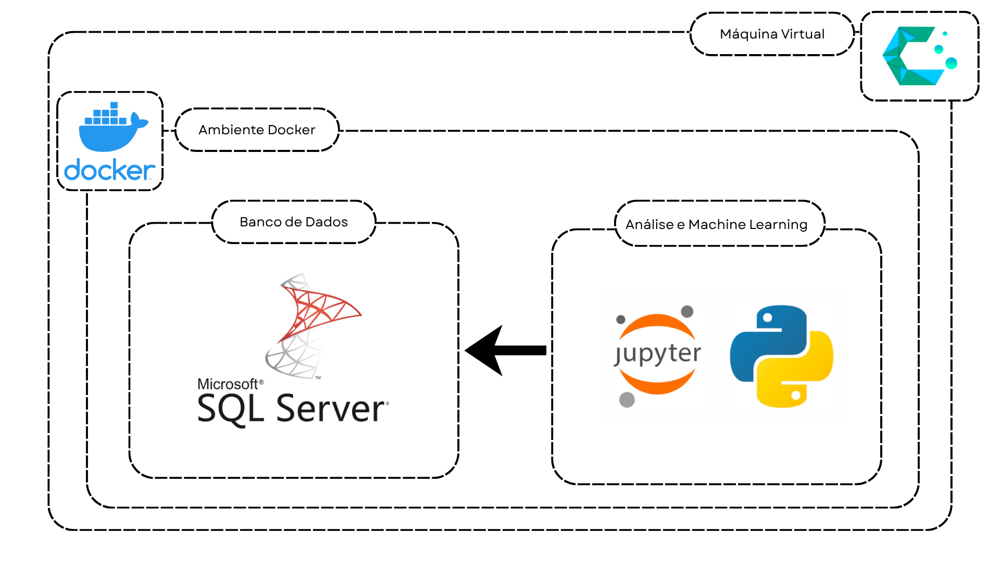

# 🚀 Projeto Data Science & Infraestrutura Multi-Container

Este projeto consiste em um ambiente completo de análise de dados e machine learning rodando de forma isolada e containerizada através do Docker, hospedado em uma máquina virtual com o sistema operacional CachyOS.

---

## Arquitetura da Infraestrutura



Como ilustrado no diagrama acima:
1. Uma **Máquina Virtual** roda o sistema **CachyOS** como base de toda a operação.
2. Dentro dela, o **Ambiente Docker** gerencia o isolamento e o ciclo de vida dos serviços.
3. Dois contêineres principais operam de forma integrada:
   * **Análise e Machine Learning:** Ambiente **Jupyter Notebook** utilizando **Python** para processamento, engenharia de recursos e modelagem.
   * **Banco de Dados:** Servidor **SQL Server** de onde o ambiente de dados consome as informações com segurança.

---

## 🛠️ Tecnologias Utilizadas

*   **SO Base:** CachyOS (Linux)
*   **Orquestração/Containers:** Docker / Docker Compose
*   **Linguagem Principal:** Python
*   **Ambiente de Desenvolvimento:** Jupyter Notebook
*   **Banco de Dados:** Microsoft SQL Server

---

<!--
## 🚀 Como Executar o Projeto

### Pré-requisitos
Antes de começar, você precisará ter instalado na sua VM:
*   [Docker](https://docker.com)
*   [Docker Compose](https://docker.com)

### Passo a Passo

1. **Clone o repositório:**
   ```bash
   git clone https://github.com
   cd seu-repositorio
   ```

2. **Suba os contêineres:**
   Execute o comando abaixo na raiz do projeto para inicializar o SQL Server e o Jupyter simultaneamente:
   ```bash
   docker compose up -d
   ```

3. **Acesse as ferramentas:**
   * **Jupyter Notebook:** Acesse via navegador em `http://localhost:8888` (verifique o token gerado no log do container).
   * **SQL Server:** Disponível na porta padrão `1433`.

---

## 📁 Estrutura de Pastas

```text
├── data/                  # Scripts SQL, dumps e sementes do banco de dados
├── notebooks/             # Arquivos .ipynb com as análises e modelos Python
├── arquitetura.png        # Imagem do diagrama de infraestrutura
├── .gitignore             # Arquivos ignorados pelo Git (.env, caches do Jupyter, etc)
├── docker-compose.yml     # Configuração multi-container do ambiente
└── README.md              # Documentação principal do projeto
```
--!>
